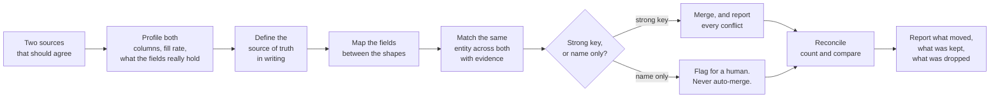

# Data Sync, Deduplication & Reconciliation

`METHOD + CASE INDEX`

**Project type:** Method write-up tying together verified client work and published open-source tooling
**Evidence:** completed Upwork contracts (all 5.0), public Fiverr reviews, and two open-source tools with passing CI

---

This is the thread that runs through most of what I am hired for. Contact sync,
duplicate cleanup, migration verification and reconciliation look like four
different jobs. They are one job: **two systems that are supposed to agree, and
do not.**

This page is the method. The individual engagements live in their own
repositories and are linked from each section.

## The failure this prevents

Two address books drift apart. The phone number is updated on the iPhone, the
email in Gmail, and the same person now exists twice with half the information in
each copy. Import one into the other and you do not fix it — you double it.

The same shape appears everywhere: a CRM export where the same company is
"Acme", "Acme Traders" and "Acme Traders Pvt Ltd"; a migration where 4,000 files
arrived and nobody can say whether it was all of them; a grant database where one
applicant applies twice under two spellings.

## The method

### 1. Profile before deciding anything

Before a rule is written, the data gets read: which columns exist, how full they
are, which ones actually hold what their header claims. Most "the sync is wrong"
tickets are a field that was never populated in the first place.

### 2. Define the source of truth, in writing, before the first run

One system wins. If that sentence does not exist in writing before anything is
migrated, it gets decided by accident, at speed, by whichever job ran last.

### 3. Map the fields as data

The field map is written down and reviewed by the person who knows what the
field names mean. Most integration failures are a mapping assumption, not a bug.
Reference implementation:
**[api-webhook-integration-patterns → src/map.js](https://github.com/skmalikllc/api-webhook-integration-patterns/blob/main/src/map.js)**.

### 4. Match with evidence, not with a verdict

A match should come back with the reason it matched. Several signals, weighted:

- **Email** — `Ali.Raza@gmail.com` and `aliraza+crm@gmail.com` are the same
  mailbox; `a.b@outlook.com` and `ab@outlook.com` are **not**. The dot rule is a
  Gmail behaviour, not a general one.
- **Phone** — compared on the last 9 digits, so `+92 300 1234567`,
  `0300-1234567` and `00923001234567` line up without guessing a country.
- **Name** — accent- and punctuation-insensitive, order-insensitive
  (`Raza, Ali` = `Ali Raza`), edit distance for the rest.
- **Company / organisation** — a tie-breaker on top of a name match, never a key
  on its own.

A shared email or phone is strong evidence. A similar name alone is not enough
to merge. Groups form transitively — A matches B by phone, B matches C by email,
so A, B and C are one person — and the threshold is a parameter, not a constant
buried in the code.

### 5. Merge conservatively, and report the conflicts

Keep the most complete record as the base, fill blanks from the others, prefer
the longer value when one contains the other (`Beta Foods` → `Beta Foods Pvt
Ltd`), and **report everything else as a conflict** instead of silently picking
a winner.

### 6. Reconcile, then say what happened

Count it. Compare it. A migration is not finished when the transfer finishes; it
is finished when someone can answer "did everything arrive, and is anything
different". Ambiguities get escalated, not resolved by guesswork.

## The evidence behind each part

| Part of the method | Where it was done | Repository |
|---|---|---|
| Matching and merging, with tests | Open-source MCP server: 9 unit tests + end-to-end test, CI green on Node 20/22/24 | **[contact-dedupe-mcp](https://github.com/skmalikllc/contact-dedupe-mcp)** |
| Cross-platform contact reconciliation | Completed Upwork contract, client-rated **5.0** — the client's own review says the result worked *"across systems without any data loss or duplication"* | **[icloud-google-contacts-sync](https://github.com/skmalikllc/icloud-google-contacts-sync)** |
| Recoverable snapshots of contact data | Completed Upwork contract, client-rated **5.0** | **[n8n-google-contacts-backup](https://github.com/skmalikllc/n8n-google-contacts-backup)** |
| Migration inventory and file-by-file reconciliation | Multiple completed engagements across Google Drive, OneDrive, Dropbox and Mega | **[cloud-file-migration-case-studies](https://github.com/skmalikllc/cloud-file-migration-case-studies)** |
| Getting tabular data out of a system that will not export it | Open-source Chrome extension: 7 tests, CI green | **[table-to-sheets](https://github.com/skmalikllc/table-to-sheets)** |
| Duplicate prevention inside a client database | Three completed Airtable engagements; internals private | **[airtable-systems-portfolio](https://github.com/skmalikllc/airtable-systems-portfolio)** |
| Validation and field mapping at an API boundary | Technical lab, mine, newly written | **[api-webhook-integration-patterns](https://github.com/skmalikllc/api-webhook-integration-patterns)** |

## What is deliberately not claimed

- No numbers on records processed, duplicates found or time saved. I do not have
  audited figures for those, so there are none here.
- No client system internals, schemas, exports or record counts.
- No claim that every engagement used all six steps. Some were small.

## Privacy

No client names, data, exports, credentials or file names appear anywhere in this
portfolio.

---

Part of **[automation-portfolio](https://github.com/skmalikllc/automation-portfolio)**.
